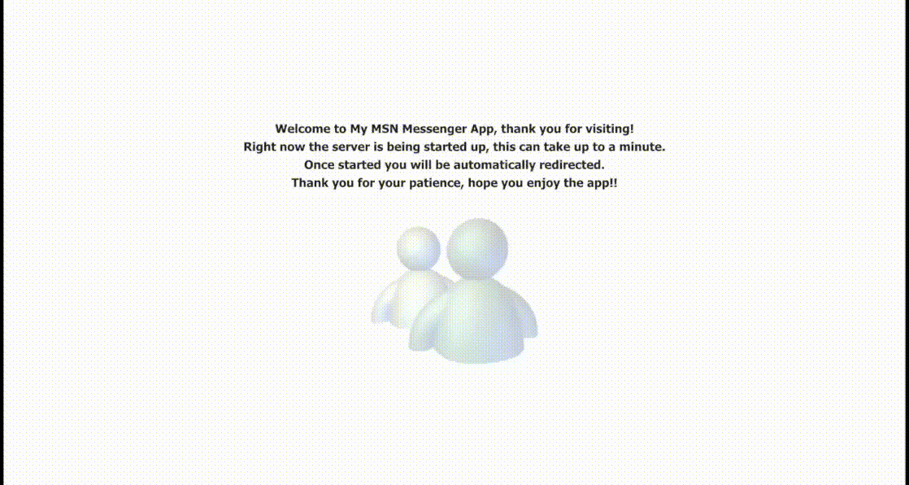
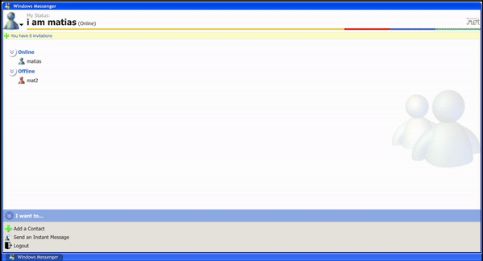

# MSN Messenger copy

_A web-based clone of the classic MSN Messenger, built with TypeScript, React, Node.js, Express and Webscokets. This project aims to replicate the core functionalities of MSN Messenger, including real-time chat, user status updates, and contact management._

## Features

- **Real-time Chat:** Engage in real-time messaging with your contacts.
- **User Status Updates:** See the current status of your contacts (online, offline, etc.).
- **Contact Management:** Add, accept, and reject contact requests to manage your contact list.
- **Receive Notifications:** Get notifications on new messages and user connections.
- **Tab management:** Manage tabs with Windows XP's style.





## What's New

Exciting new features have been introduced to enhance your chat experience:

- **Styled Chat Messages:** Customize the appearance of your chat messages with various styling options to make your conversations more personal and fun.
- **Send Nudges:** Feeling ignored? Send a nudge to grab your friend's attention, just like in the classic MSN Messenger days.
- **Block/Unblock Contacts:** Gain more control over your interactions by easily blocking or unblocking contacts from your list.

These features are designed to make your experience even more engaging and reminiscent of the original MSN Messenger.




## Usage

### Basic Instructions

1. **Register an Account:**
   - Open the application in your browser.
   - Navigate to the registration page and create a new account. (Get a .NET Passport)

2. **Login:**
   - Use your registered credentials to log in.

3. **Add Contacts:**
   - Use the 'Add Contact' functionality to find and add contacts.
   - Send contact requests and manage incoming requests.

4. **Chat:**
   - Start a conversation with your contacts.
   - Enjoy real-time messaging and status updates.

### API Endpoints

The following API endpoints are available for interacting with the server:

- POST ``/user/login``: Log in to the application.
- GET ``/user/logout``: Log out of the application (requires authentication).
- POST ``/user/register``: Register a new account.
- GET ``/user/auth``: Check user authentication status. Used for client protected routes.
- POST ``/user/contact-request/send``: Send a contact request (requires authentication).
- POST ``/user/contact-request/accept``: Accept a contact request (requires authentication).
- POST ``/user/contact-request/reject``: Reject a contact request (requires authentication).
- PUT ``/user/update/username``: Update your username (requires authentication).
- POST ``/user/search-contact``: Search for contacts (requires authentication).
- POST ``/user/block``: Block contact (requires authentication).
- POST ``/user/unblock``: Unblock contact (requires authentication).

### WebSocket Events

The application uses WebSocket for real-time communication. Here are the events:

- **register-user:** Register the user with the server and update their status to online.
- **user-status-change:** Change the user's status (e.g., online, offline).
- **get-chat-history:** Retrieve the chat history for a specific chat.
- **new-message:** Send a new message in a chat.
- **user-typing:** Notify when a user is typing.
- **logout:** Disconnect the user from the server.
- **disconnect:** Handle user's socket disconnection.

## Technologies Used

- [React](https://reactjs.org/)
- [TypeScript](https://www.typescriptlang.org/)
- [Node.js](https://nodejs.org/)
- [Express](https://expressjs.com/)
- [Socket.io](https://socket.io/)
- [JSON Web Tokens](https://jwt.io/)
- [Mongoose](https://mongoosejs.com/)
- [Sass](https://sass-lang.com/)

## Installation

### Prerequisites

- Node.js (version 18.x.x recommended)
- npm (version 8.x.x recommended)

```
npm install -g typescript
npm install -g nodemon
```

### Clone the Repository

```
git clone https://github.com/mmillenaar/my-msn-messenger.git
cd my-msn-messenger
```

### Install dependencies
#### For the Client
```
cd client
npm install
```
#### For the Server
```
cd server
npm install
```

### Set Up Environment Variables

#### For the Client:
Create a `.env` file in the `client` directory and add the necessary environment variables. Example:

```
REACT_APP_BACKEND_URL=http://localhost:3030
```

#### For the Server:
Create a `.env` file in the `server` directory and add the necessary environment variables. Example:

```
PORT=3030
NODE_ENV=development
MONGOURL=your-database-url
JWT_SECRET=your-secret-key
CLIENT_ORIGIN=http://localhost:3000
```

### Start the Server
```
cd server
npm run dev
```

### Start the Client
```
cd client
npm start
```